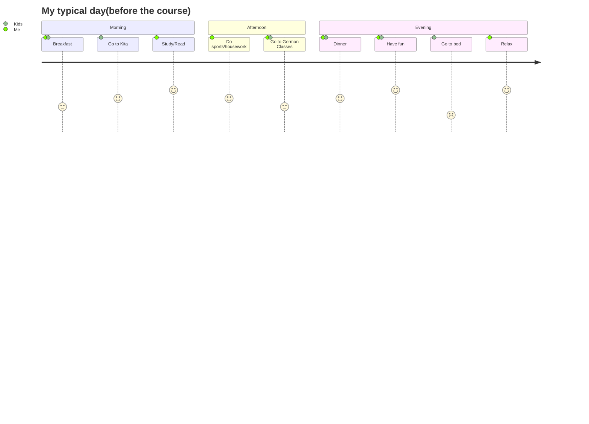

## Hello! Welcome to my profile page :wave:	

Here is how my name sounds in my mother tounge:[Click here to download the recording](https://github.com/WildCodeSchool/2023-01-EN-Berlin-Remote2-Markdown/blob/main/assets/alisa-popova.m4a)

**Some facts about me:**

- Live in *Berlin* for 2 years
- Came from *Ukraine(Kharkiv)*
- Worked as **Quality Assurance Engineer** in different IT companies for more than 5 years
- Worked as **Electrical Engineer** before going to IT 
- Graduated form Polytechnical Institute, Energy Management speciality

