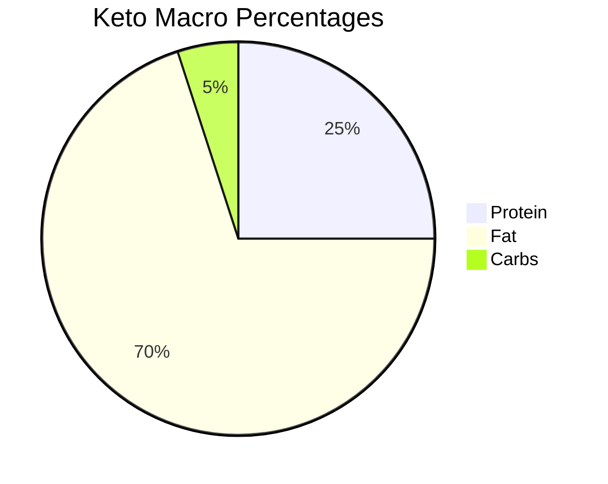
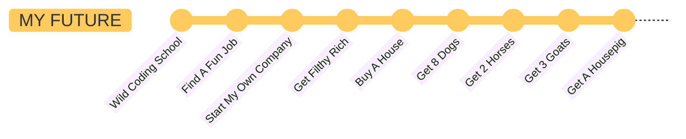

# Hello & Welcome   

My name is *David Figueroa*.  

*This* is me ↓

But more **importantly** this is my dog ↓

Her name is *Nosh*. She probably will jump into the videochat sometimes.  

---

This is how you pronounce my name: [Listen here](https://github.com/WildCodeSchool/2023-01-EN-Berlin-Remote2-Markdown/blob/main/assets/david-figueroa.wav?raw=true)

---

My favorite food is:  
1. Bibimbap
2. Tacos
3. Ceviche

---
Sometimes i do a ketogenic diet. The goal is to eat 5% or less carbohydrates.  

---

Like a very wise man once said:  
> Lets get schwifty
> 
---
## This is how my typical week looks like:

| mon | tue | wed | thu | fri | sat | sun |
| --- | --- | --- | --- | --- | --- | --- |
| hustlin | hustlin | hustlin | hustlin | hustlin | hustlin | hustlin |

---

## This is how i want my future to look like:  

---

Thank you for reading. Before you leave please let me know your opinion:  

This was:  
- [x] Silly
- [ ] Great

