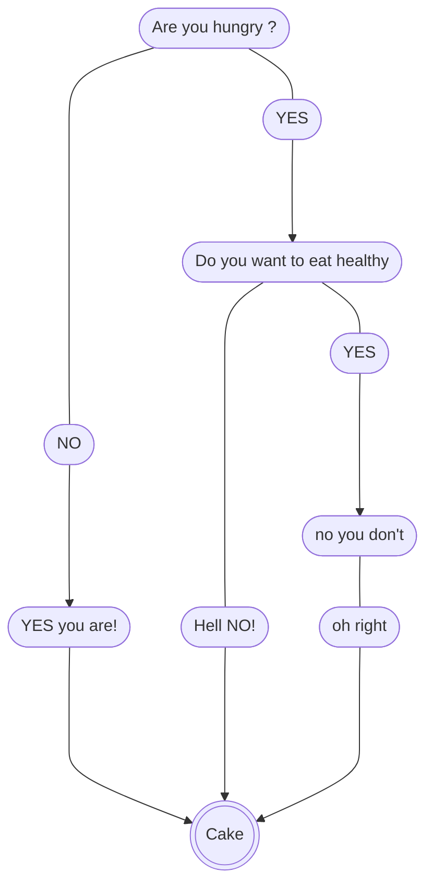

# Dejan 

## About

> #### Dejan Gogov

# Test

- [x] FirstName: *Dejan*[^1]
- [x] LastName: *Gogov*
- [x] Counry: *Macedonia*
- [x] Age: *31*
- [x] Hoby: Playing Guitar
- [x] Bachelor's degree
     * *Agricultural Engineering*

- [x] Current Learning:

     * *Web Development*[^2]

HELLO AGAIN

### Discover are you hungry
 

     

[^1]: [click here to find out how to pronounce my name in my native language](https://github.com/WildCodeSchool/2023-01-EN-Berlin-Remote2-Markdown/blob/main/assets/name.mp3?raw=true)
[^2]: Full-Stack Development , Mentor: @[OrwaDiraneyya](https://github.com/diraneyya)

