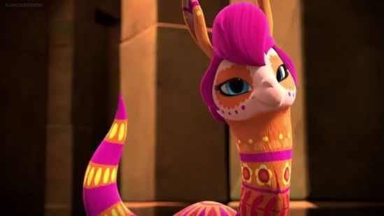
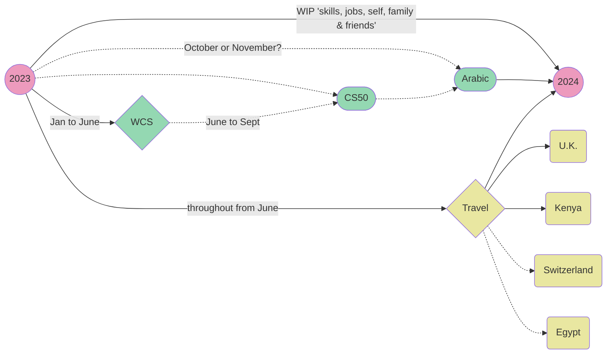

# Sarah

## *Supercalifragilisticexpialidocious*♫

## Hi, I'm Sarah 🤓 ! And this is a super short profile on me.

Being German/Egyptian, my first name is pronounced the Arabic way: [Click here for a sample](https://github.com/WildCodeSchool/2023-01-EN-Berlin-Remote2-Markdown/blob/main/assets/keller-sarah.m4a?raw=true)

## ***Things I like***:
1. Dogs (animals in general) ::dog::
2. Laughs :laughing:
3. Old buildings
4. Beaches

## ***~~Things I dislike:~~***
1. Fresh coriander[^1]
2. Saunas/steam rooms
3. When people play devil's advocate
4. Alarm clocks

### If I had to choose an animated character to identify with, I'd choose *Flo the Alpacamundi*[^2]

## 2023 Year of Learning🌍📖✨

Thanks for attending my TED talk! 😉

[^1]: Taste and smell.
[^2]: From the Disney show 'Elena of Avalor'.
