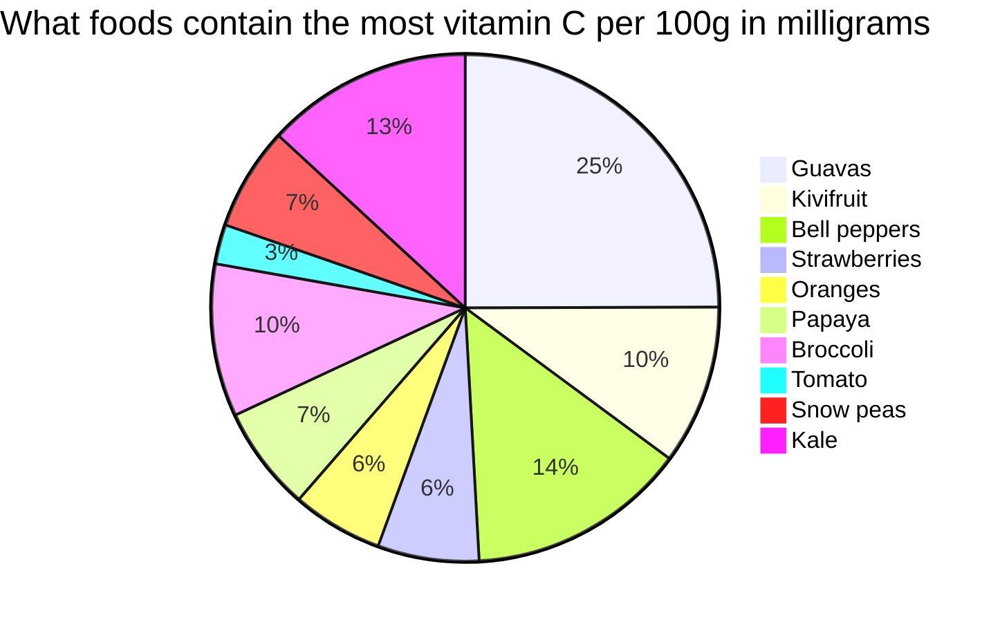

# Yevheni

## Country of origin, name, age

My name is Yevhenii. I am 29. I was born in Ukraine.

## My education

- In **_2009_** I finished studying at a secondary school.
- In **_2014_** I graduated from a university as a teacher of English and literature.
- In the *following years* I finished several courses gaining knowledge in traditional massage and the CMS Joomla.
- Recently, I have started the prepation to pass my fitness trainer and sports nutritionist certification exam.
- Currently, I study at a coding school. [Here](https://www.wildcodeschool.com/de-DE "Wold Code School Name") you can visit their website.

*## My hobbies and pets*

When I have free time, I like to read, listen to music, do fitness exercises, and learn something new. I also like taking pictures with a camera.  
I also have a cat whose name is Matilda. Here you can see the picture of her.

<h4>Heading</h4>

